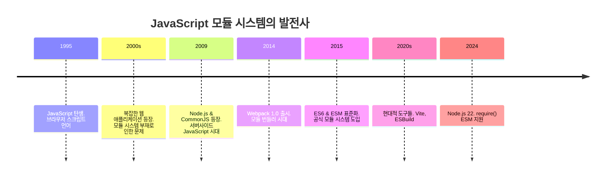
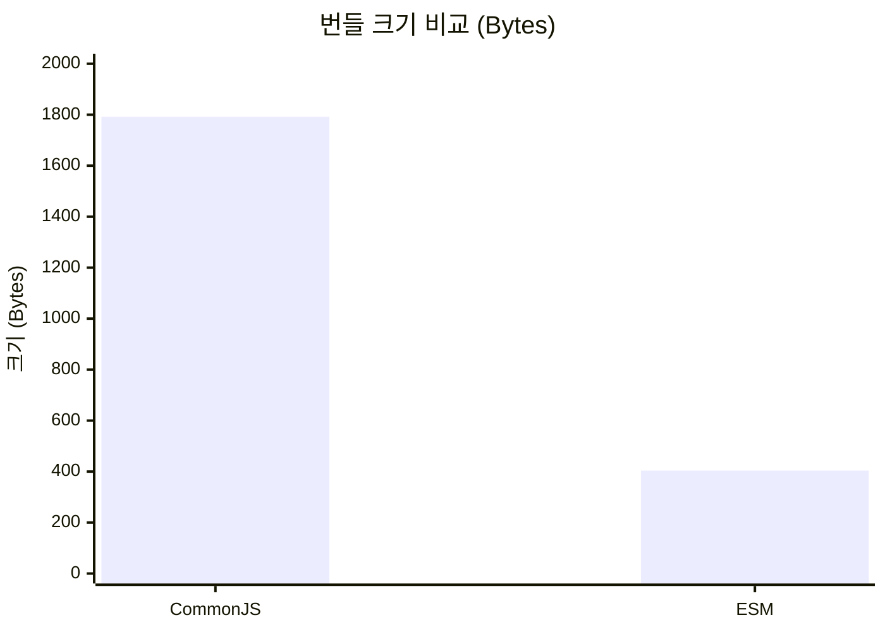
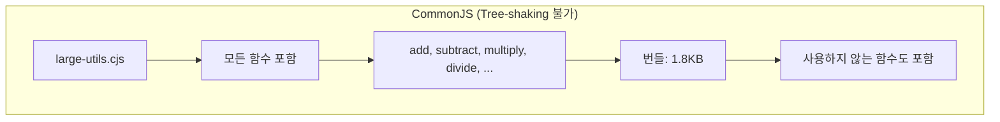
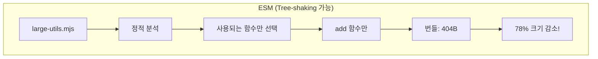
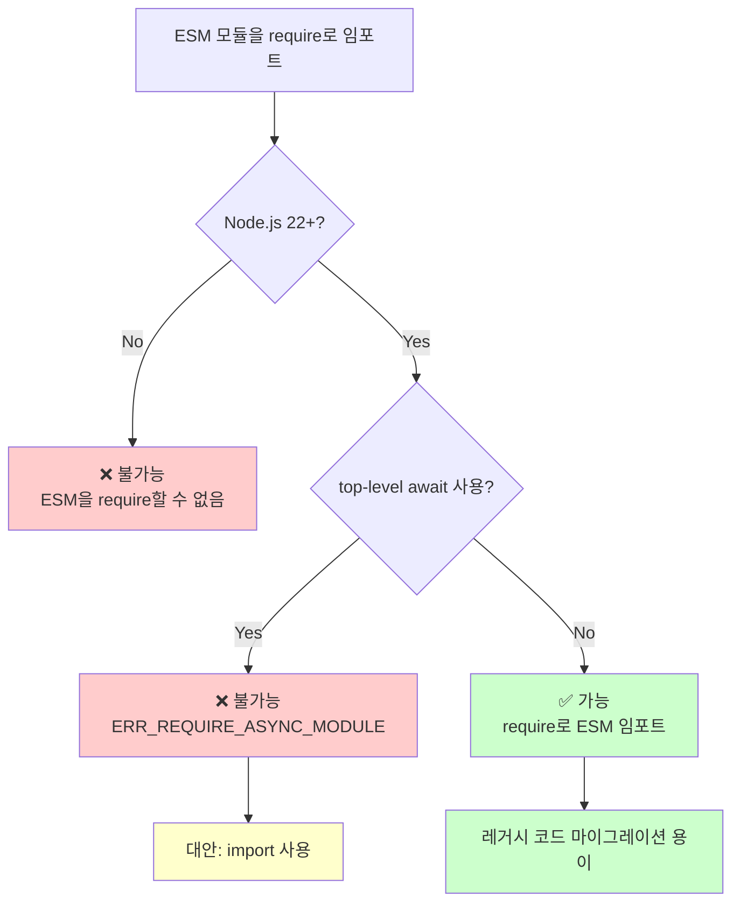
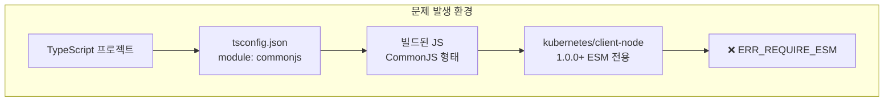
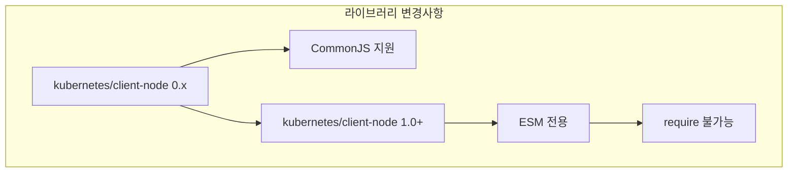

# CommonJS 와 ESM 비교하기

## 📋 목차 (Table of Contents)

1. [개요](#개요)
2. [CommonJS](#commonjs)
   - [특징](#commonjs-특징)
   - [동적 로딩 예제](#commonjs-동적-로딩-예제)
3. [ESM (ECMAScript Modules)](#esm-ecmascript-modules)
   - [특징](#esm-특징)
   - [정적 임포트 예제](#esm-정적-임포트-예제)
   - [동적 임포트 예제](#esm-동적-임포트-예제)
4. [핵심 차이점 정리](#핵심-차이점-정리)
5. [Tree-shaking](#tree-shaking)
   - [개념 설명](#tree-shaking-개념)
   - [실습 예제](#tree-shaking-실습-예제)
   - [번들 크기 비교](#번들-크기-비교)
6. [Node.js 22의 새로운 기능](#nodejs-22의-새로운-기능)
   - [require()ing Synchronous ESM Graphs](#requireing-synchronous-esm-graphs)
   - [제한사항](#제한사항)
   - [실습 예제](#nodejs-22-실습-예제)
   - [실제 프로젝트 적용 사례](#실제-프로젝트-적용-사례)
7. [참고자료](#참고자료)

---

## 개요

Javascript는 원래 브라우저에 동작을 구현하기 위한 스크립트 언어였습니다. 따라서 복잡한 설계가 들어가지 않았고, 2000년대 말에 Flash, Silverlight 등의 RIA 붐이 일어나기 전에는 웹 페이지를 구현하기 위해 5000줄이 넘어가는 스크립트를 작성하는 경우도 자주 볼 수 있었습니다.



그 후 CPU의 병렬 처리 능력 향상과 V8 엔진 등의 발전으로 Javascript가 처리할 수 있는 영역이 급속도로 넓어지면서 2009년에 Node.js가 발표되었고, Node.js가 2009년에 처음 발표될 때, CommonJS 모듈 시스템이 같이 공개되었습니다. 덩치가 큰 서버 어플리케이션을 만들 때는 필수적으로 코드를 여러 개의 모듈로 쪼개서 프로젝트를 구성해야 하는데 원래 Javascript에는 그런 개념이 없었기 때문이죠.

그 후 Javascript는 아주 느린 속도로 현대적인 언어가 되어갔습니다. 그리고 2015년, ES6 표준과 함께 ESM(ECMAScript Module)이 도입되었습니다. 드디어 Javascript를 활용하는 환경 어디든(브라우저, 서버) 모두 공통적으로 활용할 수 있는 모듈 시스템이 생긴거죠.

## CommonJS

### CommonJS 특징

CommonJS는 module.exports를 통해 모듈의 기능을 외부로 내보내고, require()를 통해 다른 모듈을 임포트 합니다. require()를 통한 임포트는 다음과 같은 특성이 있습니다.

- 모듈 로드는 동기적(synchronous)으로 이루어집니다. 따라서 require()를 통히 모듈 임포트가 모두 끝나기 전에는 코드 실행이 중지됩니다.
- 어떤 모듈을 로드할지 컴파일 타임에는 알 수 없으며, 코드가 실행되는 런타임에 동적(dynamic)으로 결정됩니다. 따라서 webpack과 같은 번들러는 어떤 모듈이 실제로 로드될지 알 수 없으므로 모듈의 일부만 사용되더라도 전체 모듈을 번들링해야 합니다. 즉, tree-shaking이 불가능합니다.

즉, 모듈을 동기적(synchronous)으로 로드하지만, 실제로 어떤 모듈이 로드될지 컴파일 시점에는 알 수 없는 동적(dynamic) 로딩이 진행된다는 겁니다. 다음 예제를 볼까요?

### CommonJS 동적 로딩 예제

우선 모듈을 2개 만들어 줍니다.

```javascript
// resolution-time/math-utils.cjs
console.log("math-utils.js 로딩 중");

function add(a, b) {
  return a + b;
}

function subtract(a, b) {
  return a - b;
}

function multiply(a, b) {
  return a * b;
}

module.exports = {
  add,
  subtract,
  multiply,
};
```

```javascript
// resolution-time/string-utils.cjs
console.log("string-utils.js 로딩 중");

function capitalize(str) {
  return str.charAt(0).toUpperCase() + str.slice(1);
}

function reverse(str) {
  return str.split("").reverse().join("");
}

function truncate(str, length) {
  return str.length > length ? str.substring(0, length) + "..." : str;
}

module.exports = {
  capitalize,
  reverse,
  truncate,
};
```

각각 간단한 함수 몇 가지를 선언하고, module.exports를 통해 외부로 내보내고 있습니다. 파일의 확장자가 `cjs`인 이유는 이 파일이 CommonJS 모듈 시스템을 사용하는 파일이라는 것을 명시하기 위해서입니다.

이제 런타임에 모듈을 로드하는 코드를 작성해 보겠습니다.

```javascript
// resolution-time/commonjs-runtime.cjs
console.log("=== CommonJS 런타임 해석 데모 ===");

// 사용자의 입력을 받습니다.
const userChoice = process.argv[2];
console.log(`사용자가 선택한 값: ${userChoice}`);

// 런타임에 로드할 모듈을 결정 - 사용자의 입력에 따라 어떤 모듈을 로드할지 결정합니다.
let utils;
if (userChoice === "math") {
  // (1) 사용자가 math를 선택한 경우
  console.log("런타임에 수학 유틸리티 로딩 중...");
  utils = require("./math-utils.cjs");
} else if (userChoice === "string") {
  // (2) 사용자가 string을 선택한 경우
  console.log("런타임에 문자열 유틸리티 로딩 중...");
  utils = require("./string-utils.cjs");
} else {
  // (3) 사용자가 값을 입력하지 않은 경우
  console.log("런타임에 두 유틸리티 모두 로딩 중...");
  const mathUtils = require("./math-utils.cjs");
  const stringUtils = require("./string-utils.cjs");
  utils = { ...mathUtils, ...stringUtils };
}

// 런타임에 동적으로 로드된 모듈을 사용합니다.
if (userChoice === "math") {
  // (1) 사용자가 math를 선택한 경우
  console.log("수학 결과:", utils.add(5, 3));
} else if (userChoice === "string") {
  // (2) 사용자가 string을 선택한 경우
  console.log("문자열 결과:", utils.capitalize("hello world"));
} else {
  // (3) 사용자가 값을 입력하지 않은 경우
  console.log("수학 결과:", utils.add(5, 3));
  console.log("문자열 결과:", utils.capitalize("hello world"));
}

// 또 다른 예시: 함수 내에서 조건부 require를 사용합니다.
function getFormatterForType(type) {
  if (type === "number") {
    return require("./math-utils.cjs");
  } else {
    return require("./string-utils.cjs");
  }
}

console.log("\n함수 내에서 동적 로딩:");
const formatter = getFormatterForType("string");
console.log("포맷된 결과:", formatter.capitalize("dynamic loading"));
```

코드가 좀 복잡해보이지만 위에서 부터 천천히 확인해보면 다음과 같습니다.

1. 사용자의 입력을 파라미터로 받습니다.
2. 입력에 따라 어떤 모듈을 로드할지 결정합니다.
3. 로드된 모듈을 통해 결과를 출력합니다.
4. 함수 내에서 조건부로 모듈을 로드할 수도 있습니다.

이제 코드를 실행해볼까요?

```bash
> node resolution-time/commonjs-runtime.cjs math
=== CommonJS 런타임 해석 데모 ===
사용자가 선택한 값: math
런타임에 수학 유틸리티 로딩 중...
math-utils.js 로딩 중
수학 결과: 8

함수 내에서 동적 로딩:
string-utils.js 로딩 중
포맷된 결과: Dynamic loading
```

파라미터로 math를 입력하자 `math-utils.cjs` 모듈만 로드되었고, 이후 함수 내에서 동적으로 `string-utils.cjs` 모듈을 로드하는 코드가 실행되었습니다.

## ESM (ECMAScript Modules)

### ESM 특징

ESM은 모듈의 기능을 export 키워드를 통해 외부로 내보내고, import 키워드를 통해 다른 모듈을 임포트 합니다. import 키워드를 통한 임포트는 다음과 같은 특성이 있습니다.

- 모듈의 첫 번째 코드가 실행되기 전에 모든 import가 진행됩니다. 따라서 어떤 모듈을 로드하는지 정적(static)으로 결정되므로, 실제로 로드되는 항목만 번들링하는 tree-shaking이 가능합니다.
- 비동기적(asynchronous)으로 모듈을 로드할 수 있습니다. 따라서 모듈을 로드하는 동안 중단없이 코드를 실행할 수도 있습니다.

즉, 모듈을 비동기적(asynchronous)으로 로드하고, 어떤 모듈을 로드할지 정적(static)으로 결정되므로, 실제로 로드되는 항목만 번들링하는 tree-shaking이 가능하다는 겁니다. 다음 예제를 볼까요?

### ESM 정적 임포트 예제

이번에도 모듈을 2개 먼저 선언하겠습니다.

```javascript
// resolution-time/math-utils.mjs
console.log("math-utils.mjs 로딩 중");

export function add(a, b) {
  return a + b;
}

export function subtract(a, b) {
  return a - b;
}

export function multiply(a, b) {
  return a * b;
}
```

```javascript
// resolution-time/string-utils.mjs
console.log("string-utils.mjs 로딩 중");

export function capitalize(str) {
  return str.charAt(0).toUpperCase() + str.slice(1);
}

export function reverse(str) {
  return str.split("").reverse().join("");
}

export function truncate(str, length) {
  return str.length > length ? str.substring(0, length) + "..." : str;
}
```

각각의 함수를 export 키워드를 통해 외부로 내보내고 있습니다. 파일의 확장자가 `mjs`인 이유는 이 파일이 ESM 모듈 시스템을 사용하는 파일이라는 것을 명시하기 위해서입니다.

이제 런타임에 모듈을 로드하는 코드를 작성해 보겠습니다.

```javascript
// resolution-time/esm-static.mjs
// esm-static.mjs
console.log("=== ESM 정적 해석 데모 ===");

// ESM을 임포트는 컴파일 타임에 로드할 모듈이 결정됩니다.
import { add, multiply } from "./math-utils.mjs";
import { capitalize, reverse } from "./string-utils.mjs";

console.log("모든 임포트가 컴파일 타임에 해석되었습니다!");

// 사용자의 입력을 받습니다.
const userChoice = process.argv[2];
console.log(`사용자가 선택한 값: ${userChoice}`);

// 모듈이 이미 로드되어 있으므로, 사용할 함수를 선택합니다.
if (userChoice === "math") {
  // (1) 사용자가 math를 선택한 경우
  console.log("수학 결과:", add(5, 3));
  console.log("수학 결과:", multiply(4, 7));
} else if (userChoice === "string") {
  // (2) 사용자가 string을 선택한 경우
  console.log("문자열 결과:", capitalize("hello world"));
  console.log("문자열 결과:", reverse("hello"));
} else {
  console.log("수학 결과:", add(5, 3));
  console.log("문자열 결과:", capitalize("hello world"));
}
```

코드는 다음과 같은 동작을 수행합니다.

- 모듈에서 사용할 함수만 선택적으로 임포트합니다.
- 사용자의 입력을 받습니다.
- 사용자의 입력에 따라 로드된 모듈의 함수를 사용합니다.

코드를 실행해볼까요?

```bash
> node resolution-time/esm-static.mjs math
math-utils.mjs 로딩 중
string-utils.mjs 로딩 중
=== ESM 정적 해석 데모 ===
모든 임포트가 컴파일 타임에 해석되었습니다!
사용자가 선택한 값: math
수학 결과: 8
수학 결과: 28
```

앞서 설명 드린 대로, 첫 번째 코드가 실행되기 전에 모듈의 임포트가 진행되었습니다. 코드를 실행하지 않아도 어떤 모듈이 로드될지 정적(static)으로 알 수 있다는 거죠!

### ESM 동적 임포트 예제

자 그러면, 앞선 CommonJS 예제 처럼 동적으로 모듈을 로드해볼까요?

```javascript
// resolution-time/esm-dynamic.mjs
// esm-dynamic.mjs
console.log("=== ESM 동적 임포트 데모 ===");

// 사용자의 입력을 받습니다.
const userChoice = process.argv[2];
console.log(`사용자가 선택한 값: ${userChoice}`);

// ESM에서 동적으로 모듈을 로드합니다.
let utils;
if (userChoice === "math") {
  // (1) 사용자가 math를 선택한 경우
  console.log("수학 유틸리티를 동적으로 임포트 중...");
  utils = await import("./math-utils.mjs");
} else if (userChoice === "string") {
  // (2) 사용자가 string을 선택한 경우
  console.log("문자열 유틸리티를 동적으로 임포트 중...");
  utils = await import("./string-utils.mjs");
} else {
  // (3) 사용자가 값을 입력하지 않은 경우
  console.log("두 유틸리티를 모두 동적으로 임포트 중...");
  const [mathUtils, stringUtils] = await Promise.all([
    import("./math-utils.mjs"),
    import("./string-utils.mjs"),
  ]);
  utils = { ...mathUtils, ...stringUtils };
}

// 런타임에 동적으로 로드된 모듈을 사용합니다.
if (userChoice === "math") {
  // (1) 사용자가 math를 선택한 경우
  console.log("수학 결과:", utils.add(5, 3));
} else if (userChoice === "string") {
  // (2) 사용자가 string을 선택한 경우
  console.log("문자열 결과:", utils.capitalize("hello world"));
} else {
  // (3) 사용자가 값을 입력하지 않은 경우
  console.log("수학 결과:", utils.add(5, 3));
  console.log("문자열 결과:", utils.capitalize("hello world"));
}

// 함수 내에서 동적으로 모듈을 로드합니다.
async function getFormatterForType(type) {
  if (type === "number") {
    return await import("./math-utils.mjs");
  } else {
    return await import("./string-utils.mjs");
  }
}

console.log("\n함수 내에서 동적 로딩:");
const formatter = await getFormatterForType("string");
console.log("포맷된 결과:", formatter.capitalize("dynamic loading"));
```

사용자의 입력에 따라 동적으로 async import를 수행하고 있습니다. 결과를 볼까요?

```bash
=== ESM 동적 임포트 데모 ===
사용자가 선택한 값: math
수학 유틸리티를 동적으로 임포트 중...
math-utils.mjs 로딩 중
수학 결과: 8

함수 내에서 동적 로딩:
string-utils.mjs 로딩 중
포맷된 결과: Dynamic loading
```

앞선 CommonJS 예제와 동일한 결과를 확인할 수 있습니다.

## 핵심 차이점 정리

### 📊 CommonJS vs ESM 비교표

| 특성              | CommonJS                       | ESM                     |
| ----------------- | ------------------------------ | ----------------------- |
| **문법**          | `require()` / `module.exports` | `import` / `export`     |
| **로딩 방식**     | 동기적 (Synchronous)           | 비동기적 (Asynchronous) |
| **해석 시점**     | 런타임 (Dynamic)               | 컴파일 타임 (Static)    |
| **Tree-shaking**  | ❌ 불가능                      | ✅ 가능                 |
| **브라우저 지원** | ❌ 번들러 필요                 | ✅ 네이티브 지원        |
| **Node.js 지원**  | ✅ 기본 지원                   | ✅ 지원 (v14+)          |
| **파일 확장자**   | `.js`, `.cjs`                  | `.js`, `.mjs`           |

### 🔄 모듈 로딩 프로세스 비교


### 핵심 요약

- **CommonJS**: 모듈을 동기적(synchronous)으로 로드하지만, 실제로 어떤 모듈이 로드될지 컴파일 시점에는 알 수 없는 동적(dynamic) 로딩이 진행됩니다.
- **ESM**: 모듈을 비동기적(asynchronous)으로 로드하고, 어떤 모듈을 로드할지 정적(static)으로 결정되므로, 실제로 로드되는 항목만 번들링하는 tree-shaking이 가능합니다.

## Tree-shaking

### Tree-shaking 개념

Tree-shaking은 배포를 위해 코드를 번들링할 때, 모듈 시스템에서 사용되지 않는 모듈을 제거하는 기능입니다. 즉, 사용하지 않는 모듈을 결과물에서 제거하여 번들 파일의 크기를 줄입니다. 번들 파일의 크기가 줄어들면 로드하는 데 걸리는 시간이 줄어들고 메모리 역시 절약할 수 있겠죠. 프로젝트가 작을 때는 티가 안나지만, 프로젝트의 크기가 커질수록 매우 큰 차이를 보입니다.

### Tree-shaking 실습 예제

에제로 확인해보죠! 다음과 같이 package.json을 작성합니다.

```json
//tree-shaking/package.json
{
  "name": "tree-shaking-demo",
  "version": "1.0.0",
  "description": "Demonstrates tree-shaking differences between CommonJS and ESM",
  "type": "module",
  "scripts": {
    "build": "webpack",
    "test-commonjs": "node commonjs-consumer.js",
    "test-esm": "node esm-consumer.mjs",
    "test-esm-multiple": "node esm-consumer-multiple.mjs"
  },
  "devDependencies": {
    "webpack": "^5.89.0",
    "webpack-cli": "^5.1.4"
  }
}
```

`npm install` 명령으로 패키지를 설치하고, 다음과 같이 webpack을 설정합니다.

```javascript
//tree-shaking/webpack.config.cjs
const path = require("path");

module.exports = {
  mode: "production", // tree-shaking을 포함한 최적화 활성화
  entry: {
    "commonjs-bundle": "./commonjs-consumer.cjs",
    "esm-bundle": "./esm-consumer.mjs",
  },
  output: {
    path: path.resolve(__dirname, "dist"),
    filename: "[name].js",
    clean: true,
  },
  optimization: {
    usedExports: true, // tree-shaking 활성화
    sideEffects: false,
  },
  resolve: {
    extensions: [".js", ".mjs"],
  },
  module: {
    rules: [
      {
        test: /\.mjs$/,
        type: "javascript/esm",
      },
    ],
  },
};
```

이제 webpack을 통해 번들링할 `commonjs-consumer.cjs`와 `esm-consumer.mjs` 파일, 그리고 각 파일에서 임포트할 유틸 모듈을 작성합니다.

우선 CommonJS 파일들 부터 작성합니다.

```javascript
// tree-shaking/large-utils.cjs (CommonJS)
console.log("large-utils.js 로딩 중 - 모든 함수가 로드됩니다!");

// 수학 함수들
function add(a, b) {
  console.log("add 함수 호출됨");
  return a + b;
}

function subtract(a, b) {
  console.log("subtract 함수 호출됨");
  return a - b;
}

function multiply(a, b) {
  console.log("multiply 함수 호출됨");
  return a * b;
}

function divide(a, b) {
  console.log("divide 함수 호출됨");
  return a / b;
}

function power(a, b) {
  console.log("power 함수 호출됨");
  return Math.pow(a, b);
}

// 문자열 함수들
function capitalize(str) {
  console.log("capitalize 함수 호출됨");
  return str.charAt(0).toUpperCase() + str.slice(1);
}

function reverse(str) {
  console.log("reverse 함수 호출됨");
  return str.split("").reverse().join("");
}

function truncate(str, length) {
  console.log("truncate 함수 호출됨");
  return str.length > length ? str.substring(0, length) + "..." : str;
}

// 배열 함수들
function sortArray(arr) {
  console.log("sortArray 함수 호출됨");
  return [...arr].sort();
}

function filterEven(arr) {
  console.log("filterEven 함수 호출됨");
  return arr.filter((num) => num % 2 === 0);
}

function sum(arr) {
  console.log("sum 함수 호출됨");
  return arr.reduce((total, num) => total + num, 0);
}

// 복잡한 유틸리티 함수들
function complexCalculation() {
  console.log("complexCalculation 함수 호출됨");
  let result = 0;
  for (let i = 0; i < 1000000; i++) {
    result += Math.sqrt(i);
  }
  return result;
}

function heavyStringProcessing(str) {
  console.log("heavyStringProcessing 함수 호출됨");
  return str.repeat(10000).split("").reverse().join("");
}

// 모든 함수 내보내기
module.exports = {
  add,
  subtract,
  multiply,
  divide,
  power,
  capitalize,
  reverse,
  truncate,
  sortArray,
  filterEven,
  sum,
  complexCalculation,
  heavyStringProcessing,
};
```

```javascript
// tree-shaking/commonjs-consumer.cjs
console.log("=== CommonJS Consumer ===");
console.log("large-utils.js에서 임포트 중...");

// CommonJS는 전체 모듈을 임포트합니다
const utils = require("./large-utils.cjs");

console.log("\nadd 함수만 사용:");
console.log("결과:", utils.add(5, 3));

console.log("\n주의: 'add'만 사용하지만, 모든 함수가 로드됩니다!");
console.log("이는 CommonJS가 전체 모듈 네임스페이스를 로드하기 때문입니다.");
```

다음으로 ESM 파일들을 작성합니다.

```javascript
// tree-shaking/large-utils.mjs (ESM)
console.log("large-utils.mjs 로딩 중");

// 수학 함수들
export function add(a, b) {
  console.log("add 함수 호출됨");
  return a + b;
}

export function subtract(a, b) {
  console.log("subtract 함수 호출됨");
  return a - b;
}

export function multiply(a, b) {
  console.log("multiply 함수 호출됨");
  return a * b;
}

export function divide(a, b) {
  console.log("divide 함수 호출됨");
  return a / b;
}

export function power(a, b) {
  console.log("power 함수 호출됨");
  return Math.pow(a, b);
}

// 문자열 함수들
export function capitalize(str) {
  console.log("capitalize 함수 호출됨");
  return str.charAt(0).toUpperCase() + str.slice(1);
}

export function reverse(str) {
  console.log("reverse 함수 호출됨");
  return str.split("").reverse().join("");
}

export function truncate(str, length) {
  console.log("truncate 함수 호출됨");
  return str.length > length ? str.substring(0, length) + "..." : str;
}

// 배열 함수들
export function sortArray(arr) {
  console.log("sortArray 함수 호출됨");
  return [...arr].sort();
}

export function filterEven(arr) {
  console.log("filterEven 함수 호출됨");
  return arr.filter((num) => num % 2 === 0);
}

export function sum(arr) {
  console.log("sum 함수 호출됨");
  return arr.reduce((total, num) => total + num, 0);
}

// 복잡한 유틸리티 함수들
export function complexCalculation() {
  console.log("complexCalculation 함수 호출됨");
  let result = 0;
  for (let i = 0; i < 1000000; i++) {
    result += Math.sqrt(i);
  }
  return result;
}

export function heavyStringProcessing(str) {
  console.log("heavyStringProcessing 함수 호출됨");
  return str.repeat(10000).split("").reverse().join("");
}
```

```javascript
// tree-shaking/esm-consumer.mjs
console.log("=== ESM Consumer ===");
console.log("large-utils.mjs에서 임포트 중...");

// ESM은 특정 함수만 임포트합니다
import { add } from "./large-utils.mjs";

console.log("\nadd 함수만 사용:");
console.log("결과:", add(5, 3));

console.log("\n주의: 'add' 함수만 임포트됩니다!");
console.log("다른 함수들은 이 모듈의 범위에 포함되지 않습니다.");
```

ESM의 경우 CommonJS와 다르게 `add` 함수만 임포트하고 있습니다. 이 코드를 빌드하고, 빌드된 파일의 크기를 확인해보겠습니다.

```bash
> npm run build
> tree-shaking-demo@1.0.0 build
> webpack

asset commonjs-bundle.js 1.79 KiB [emitted] [minimized] (name: commonjs-bundle)
asset esm-bundle.js 404 bytes [emitted] [minimized] (name: esm-bundle)
orphan modules 1.73 KiB [orphan] 1 module
modules by path ./*.cjs 2.41 KiB
  ./commonjs-consumer.cjs 528 bytes [built] [code generated]
  ./large-utils.cjs 1.89 KiB [built] [code generated]
./esm-consumer.mjs + 1 modules 2.14 KiB [built] [code generated]
webpack 5.100.0 compiled successfully in 216 ms

> ls -lh ./dist
total 16
-rw-r--r--@ 1 onlifecoding  staff   1.8K Jul 12 09:26 commonjs-bundle.js
-rw-r--r--@ 1 onlifecoding  staff   404B Jul 12 09:26 esm-bundle.js
```

### 📊 번들 크기 비교

빌드된 파일 크기에 확인할 수 있듯이 esm 번들은 404B로 1.8KB에 비해 약 22% 수준입니다.



**크기 절약 효과:**

- CommonJS 번들: 1,792 bytes (100%)
- ESM 번들: 404 bytes (22.5%)
- **절약된 크기: 1,388 bytes (77.5% 감소!)**

이렇게 간단한 예제에서도 tree-shaking을 통해 번들 파일의 크기를 꽤 줄일 수 있었는데 큰 프로젝트에서는 더 큰 차이가 나겠죠?

### 🌳 Tree-shaking 작동 원리





## Node.js 22의 새로운 기능

### require()ing Synchronous ESM Graphs

ESM이 가야할 방향인 건 분명하지만 문제는 ESM이 표준으로 제시되기까지 너무 오랜 시간이 걸렸고, CommonJS를 사용하는 레거시 코드가 너무나도 많다는 겁니다.

그러면 핵심 라이브러리가 ESM만을 지원하도록 변경된다면 어떻게 해야 될까요? 프로젝트를 ESM으로 마이그레이션 해야겠지만, 이건 그렇게 쉬운 일이 아닙니다. 그래서 Node.js 22에서는 `require()ing Synchronous ESM Graphs`라는 기능을 제공합니다.

즉, 동기적으로 해석가능한 ESM 그래프를 require를 통해 임포트할 수 있게 해주겠다는 겁니다! 이 기능을 사용하면 레거시 코드를 최소한으로 변경하면서 ESM으로 마이그레이션 할 수 있게 됩니다.

### 제한사항

주의할 점이 있다면 `동기적으로 해석가능한`에 주목해야 합니다. 만약 임포트해야 할 모듈에서 top-level await를 사용하고 있다면 이 기능을 사용할 수 없습니다.

### 🔀 Node.js 22 ESM require() 결정 트리



### Node.js 22 실습 예제

그럼 예시를 볼까요?

우선 top-level await를 사용하는 ESM 모듈과 사용하지 않는 ESM 모듈을 작성해 보겠습니다.

```javascript
// require-esm/async-math.mjs
console.log("async-math.mjs 로딩 중 (최상위 await가 있는 ESM)");

// 이 최상위 await는 require()가 작동하지 않게 합니다
const config = await Promise.resolve({ multiplier: 2 });

export function calculate(x, y) {
  return x * y * config.multiplier;
}

export const version = "1.0.0";
```

```javascript
// require-esm/math.mjs
console.log("math.mjs 로딩 중 (ESM)");

export function add(a, b) {
  return a + b;
}

export function multiply(a, b) {
  return a * b;
}

export const PI = 3.14159;

export default function calculate(x, y) {
  return x * y + PI;
}
```

이제 모듈을 로드해볼까요?

```javascript
// require-esm/test-node22-feature.js
console.log("=== Node.js 22 require(ESM) 기능 테스트 ===");
console.log("Node.js 버전:", process.version);

// 기능이 사용 가능한지 확인
if (process.features && process.features.require_module) {
  console.log("✅ require(ESM) 기능이 사용 가능합니다");
} else {
  console.log("❌ require(ESM) 기능이 사용 불가능합니다");
  console.log("다음과 같은 이유일 수 있습니다:");
  console.log("1. Node.js 22+ 버전을 사용하지 않는 경우");
  console.log("2. --experimental-require-module 플래그를 활성화해야 하는 경우");
}

console.log("\n" + "=".repeat(50));

// 테스트 1: 일반 CommonJS require
console.log("\n테스트 1: 일반 CommonJS 모듈");
try {
  const regularModule = require("./math.mjs");
  console.log("✅ ESM 모듈 require 성공");
  console.log("결과 타입:", typeof regularModule);
  console.log("사용 가능한 익스포트:", Object.keys(regularModule));
} catch (error) {
  console.log("❌ ESM 모듈 require 실패");
  console.log("오류:", error.code || error.message);
}

console.log("\n" + "=".repeat(50));

// 테스트 2: 최상위 await가 있는 ESM
console.log("\n테스트 2: 최상위 await가 있는 ESM");
try {
  const asyncModule = require("./async-math.mjs");
  console.log("✅ 이것은 작동하지 않아야 합니다!");
} catch (error) {
  console.log(
    "❌ 예상된 실패 - 최상위 await가 있는 ESM은 require할 수 없습니다"
  );
  console.log("오류:", error.code || error.message);
}

console.log("\n" + "=".repeat(50));

// 테스트 3: ESM import
console.log("\n테스트 3: 최상위 await가 있는 ESM import");
(async () => {
  try {
    const asyncModule = await import("./async-math.mjs");
    console.log("✅ ESM 모듈 import 성공");
    console.log("결과 타입:", typeof asyncModule);
    console.log("사용 가능한 익스포트:", Object.keys(asyncModule));
  } catch (error) {
    console.log("❌ 비동기 import로 ESM import 실패");
    console.log("오류:", error.code || error.message);
  }
})();
```

이 코드를 다음과 같이 진행됩니다.

- 먼저 노드 버전을 통해 동기적으로 해석가능한 ESM 그래프가 require()를 통해 임포트 가능한지 확인합니다.
- top-level await를 사용하지 않는 ESM 모듈을 require()를 통해 임포트 합니다. 임포트가 성공해야 합니다.
- top-level await를 사용하는 ESM 모듈을 require()를 통해 임포트 합니다. 임포트가 실패해야 합니다.
- 비동기 import를 통해 top-level await를 사용하는 ESM 모듈을 임포트 합니다. 임포트가 성공해야 합니다.

결과를 확인해볼까요?

```bash
> node require-esm/test-node22-feature.js
=== Node.js 22 require(ESM) 기능 테스트 ===
Node.js 버전: v22.14.0
✅ require(ESM) 기능이 사용 가능합니다

==================================================

테스트 1: 일반 CommonJS 모듈
math.mjs 로딩 중 (ESM)
✅ ESM 모듈 require 성공
결과 타입: object
사용 가능한 익스포트: [ 'PI', '__esModule', 'add', 'default', 'multiply' ]

==================================================

테스트 2: 최상위 await가 있는 ESM
❌ 예상된 실패 - 최상위 await가 있는 ESM은 require할 수 없습니다
오류: ERR_REQUIRE_ASYNC_MODULE

==================================================

테스트 3: 최상위 await가 있는 ESM import
async-math.mjs 로딩 중 (최상위 await가 있는 ESM)
✅ ESM 모듈 import 성공
결과 타입: object
사용 가능한 익스포트: [ 'calculate', 'version' ]
```

앞서 설명 드렸던 대로 top-level await를 사용하지 않는 ESM 모듈은 require()를 통해 임포트가 가능합니다. 하지만 top-level await를 사용하는 ESM 모듈은 require()로 임포트할 수 없으므로 async import를 사용해야 합니다.

### 실제 프로젝트 적용 사례

제가 개발 중 실제로 겪었던 사례를 소개해드리겠습니다.

#### 🚨 문제 상황: ESM 전용 라이브러리 사용 시 require() 불가능

기존 기능을 k8s 기반으로 전환하기 위해 프로토타이핑을 진행하고 있었습니다. 그런데 코드를 실행하자 다음과 같은 에러가 발생했습니다.

```bash
⠋  TSC  Initializing type checker.../dist/some/services/kubernetes-job.service.js:315
                    mountPath: '/workspace'
             ^

Error [ERR_REQUIRE_ESM]: require() of ES Module /node_modules/@kubernetes/client-node/dist/index.js from /some/services/kubernetes-job.service.js not supported.
Instead change the require of index.js in /dist/some/services/kubernetes-job.service.js to a dynamic import() which is available in all CommonJS modules.
    at TracingChannel.traceSync (node:diagnostics_channel:315:14)
    at Object.<anonymous> (/dist/some/services/kubernetes-job.service.js:12:61) {
  code: 'ERR_REQUIRE_ESM'
}
```

문제를 찾다보니, tsconfig.json 설정이 `"module": "commonjs"` 였고 [kubernetes-client 라이브러리가 1.0 버전 부터 ESM 전용으로 변경](https://github.com/kubernetes-client/javascript/releases/tag/1.0.0) 되었기 때문이었습니다! 게다가 node.js 버전 역시 22.11.0 이었습니다. require(esm)은 [node.js 22.12.0 부터 기본적으로 활성화](https://github.com/nodejs/node/releases/tag/v22.12.0) 되었으며, node.js 22.11.0 이하에서는 `--experimental-require-module` 플래그를 추가해야 합니다.

#### 📋 상황 분석





**핵심 문제:**

- **TypeScript 설정**: `tsconfig.json`의 `module` 설정이 `"commonjs"`
- **라이브러리 변경**: `@kubernetes/client-node` 1.0.0부터 ESM 전용 ([릴리즈 노트](https://github.com/kubernetes-client/javascript/releases/tag/1.0.0))
- **Node.js 버전**: 개발 환경의 Node.js 22.11.0에서는 기본적으로 require(ESM) 미지원. `--experimental-require-module` 플래그를 추가해야 합니다.

#### 💡 해결 방법

일단 가장 간단한 해결책으로 다음과 같이 `--experimental-require-module` 플래그를 추가했습니다.

```json
// package.json
{
  "scripts": {
    "start:dev": "NODE_OPTIONS='--experimental-require-module' nest start --watch",
    "start:prod": "NODE_OPTIONS='--experimental-require-module' node dist/main.js"
  }
}
```

그리고 문제가 해결된 걸 확인하고, node.js 버전을 현재 최신 버전인 22.17.0 으로 업데이트 했습니다.

---

## 참고자료

- [Enhancing Node.js Core: Introducing Support for Synchronous ESM Graphs](https://nodesource.com/blog/enhancing-nodejs-esm-graphs)
- [Node v22.12.0 (LTS)](https://nodejs.org/ko/blog/release/v22.12.0)
- [A Deep Dive Into CommonJS and ES Modules in Node.js](https://blog.appsignal.com/2024/12/11/a-deep-dive-into-commonjs-and-es-modules-in-nodejs.html)
- [Node.js v24.4.0 documentation](https://nodejs.org/api/modules.html)
