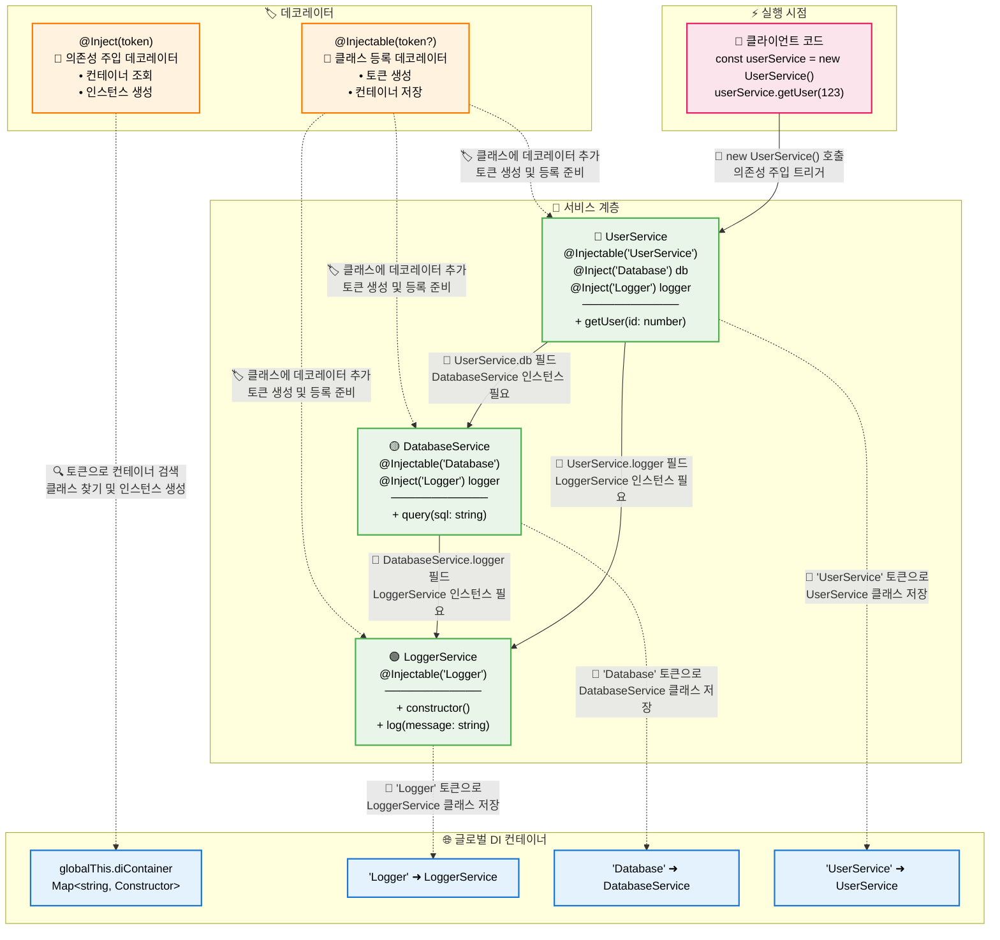

# Typescript: Decorator Metadata(5.2+)

## 목차

- [개요](#개요)
- [아주 간단한 예제](#아주-간단한-예제)
- [의존성 주입(Dependency Injection) 예제](#의존성-주입dependency-injection-예제)
- [데코레이터 메타데이터를 이용해서 의존성 주입 정보를 확인해보자](#데코레이터-메타데이터를-이용해서-의존성-주입-정보를-확인해보자)
- [reflect-metadata 와의 비교](#reflect-metadata-와의-비교)
- [참고자료](#참고자료)

## 개요

Typescript는 5.0 부터 ECMAScript의 표준에 발맞춘 Decorator를 지원하고 있습니다. 얼마전에 [이와 관련된 글](../decorator/README.md)을 쓴적이 있었죠! 그런데 ECMAScript의 표준에는 이 [데코레이터를 좀 더 강력하게 사용할 수 있는 방법](https://github.com/tc39/proposal-decorator-metadata)도 같이 제시되고 있습니다. 데코레이터의 메타데이터를 이용해서 데코레이터가 감싸고 있는 클래스의 정보를 추출하는 메타 프로그래밍을 지원합니다. Typescript 역시 5.2 버전 부터 이 기능을 지원하고 있습니다.

## 아주 간단한 예제

그럼 이 데코레이터 메타데이터가 뭔지 간단한 예제를 통해서 확인해보겠습니다. 우선 데코레이터 메타데이터를 사용하기 위해서는 다음과 같이 `tsconfig.json` 파일을 설정해야 합니다.

```json
{
  "compilerOptions": {
    "target": "es2022",
    "lib": ["es2022", "esnext.decorators", "dom"],
    "experimentalDecorators": false,
    "useDefineForClassFields": true
  }
}
```

그리고 아직 node.js가 데코레이터 메타데이터를 지원하지 않기 때문에 다음과 같이 코드에 polyfill을 추가해야 합니다.

```ts
// 프로그램의 진입점에 한 번만 선언하면 됩니다!
(Symbol as any).metadata ??= Symbol("Symbol.metadata");
```

이제 간단하게 코드를 작성해볼까요?

```ts
// src/decorator-metadata/src/simple-decorator-metadata.ts

// Symbol.metadata polyfill
(Symbol as any).metadata ??= Symbol("Symbol.metadata");

// 데코레이터 Context 인터페이스
interface Context {
  name: string;
  metadata: Record<PropertyKey, unknown>;
}

/**
 * 데코레이터 메타데이터에 필드의 이름을 추가하는 데코레이터
 * @param _target 데코레이터가 적용된 클래스
 * @param context 데코레이터 컨텍스트
 */
function setMetadata(_target: any, context: Context) {
  // 데코레이터 메타데이터에 해당 필드의 이름을 추가합니다.
  context.metadata[context.name] = true;
}

class SomeClass {
  @setMetadata
  foo = 123;

  @setMetadata
  accessor bar = "hello!";

  @setMetadata
  baz() {}
}

// 데코레이터 메타데이터를 확인합니다.
const ourMetadata = SomeClass[Symbol.metadata];
console.log(JSON.stringify(ourMetadata));
// 출력: { "bar": true, "baz": true, "foo": true }
```

이 코드는 말이죠:

- 코드 최상단에 `Symbol.metadata`를 지원하기 위한 polyfill을 추가했습니다.
- setMetadata 데코레이터 함수를 정의했습니다.
- setMetadata를 호출하면 데코레이터 메타데이터에 '해당 필드의 이름' = true 를 추가합니다.
- 데코레이터 메타데이터는 `각 클래스 별로 고유한 객체`이며, `Symbol.metadata` 을 통해 접근할 수 있습니다.

이 코드를 실행하면 다음과 같은 결과가 출력됩니다.

```bash
> npx ts-node ./src/simple-decorator-metadata.ts
{"bar":true,"baz":true,"foo":true}
```

SomeClass의 foo, bar, baz 필드에 setMetadata 데코레이터가 적용되었기 때문에 데코레이터 메타데이터에 foo, bar, baz 필드의 이름이 추가된 걸 확인할 수 있습니다.

이제 조금 더 실용적인 예제를 살펴볼까요?

## 의존성 주입(Dependency Injection) 예제

일단 데코레이터를 사용해서 의존성 주입(Dependency Injection)을 구현해보겠습니다.

> 이 예제는 테스트를 위한 구현이기 때문에 싱글턴 패턴, 순환 참조 탐지 등의 기능을 구현하지 않습니다. 실제 서비스에서는 [InversifyJS](https://github.com/inversify/InversifyJS) 같은 의존성 주입 라이브러리를 사용하는 것이 좋습니다.

```ts
// src/decorator-metadata/src/dependency-injection.ts
/**
 * Injectable 데코레이터
 * 클래스를 DI 컨테이너에 등록합니다.
 * @param token 클래스 이름
 * @returns 데코레이터 함수
 */
function Injectable(token?: string) {
  return function (target: any) {
    const registry = new Map();
    // token: Logger, target.name: LoggerService, target: LoggerService 클래스
    registry.set(token || target.name, target);

    // 환경에 상관없이 사용할 수 있도록 globalThis에 글로벌 컨테이너를 설정합니다.
    (globalThis as any).diContainer =
      (globalThis as any).diContainer || new Map();

    // 글로벌 컨테이너에 등록합니다.
    for (const [key, value] of registry) {
      (globalThis as any).diContainer.set(key, value);
    }
  };
}

/**
 * Inject 데코레이터
 * 클래스 필드에 DI로 객체의 인스턴스를 주입합니다.
 * @param token 클래스 이름
 * @returns 데코레이터 함수
 */
function Inject(token: string) {
  return function (target: any, context: ClassFieldDecoratorContext) {
    return function (this: any, initialValue: any) {
      // Inject 데코레이터를 전달되는 token(ex: Logger)에 해당하는 서비스 클래스를 찾습니다.
      const container = (globalThis as any).diContainer;
      const serviceClass = container.get(token);

      if (!serviceClass) {
        throw new Error(`컨테이너에서 ${token} 클래스를 찾을 수 없습니다.`);
      }

      return new serviceClass();
    };
  };
}

/**
 * LoggerService 클래스
 */
@Injectable("Logger")
class LoggerService {
  constructor() {
    console.log("LoggerService constructor");
  }

  log(message: string) {
    console.log(`[LOG] ${new Date().toISOString()}: ${message}`);
  }
}

/**
 * DatabaseService 클래스
 */
@Injectable("Database")
class DatabaseService {
  @Inject("Logger")
  private logger!: LoggerService;

  query(sql: string) {
    this.logger.log(`Executing: ${sql}`);
    return { rows: [] };
  }
}

/**
 * UserService 클래스
 */
@Injectable("UserService")
class UserService {
  @Inject("Database")
  private db!: DatabaseService;

  @Inject("Logger")
  private logger!: LoggerService;

  getUser(id: number) {
    this.logger.log(`Getting user ${id}`);
    return this.db.query(`SELECT * FROM users WHERE id = ${id}`);
  }
}

/**
 * 사용 예제
 */
const userService = new UserService();
userService.getUser(123);
```

조금 복잡하게 느껴집니다... 우선 실행 순서를 정리해보면 다음과 같습니다.


1. 클래스에 정의된 Injectable 데코레이터에 token(ex: Logger)과 클래스(ex: LoggerService)가 전달됩니다.
2. Injectable 데코레이터는 글로벌 DI 컨테이너에 token-클래스 매핑을 저장합니다.
3. 그 다음 Inject 데코레이터에 token(ex: Logger)이 전달되면, 글로벌 DI 컨테이너에서 token에 해당하는 클래스를 찾아서 인스턴스를 생성하여 주입합니다.
4. 의존성 주입은 제귀적으로 발생합니다.(UserService -> DatabaseService -> LoggerService)

전체 구조를 도식화 해보면 다음과 같습니다.



실행 결과는 다음과 같습니다.

```bash
> npx ts-node ./src/dependency-injection.ts
LoggerService constructor
LoggerService constructor
[LOG] 2025-09-06T00:30:24.749Z: Getting user 123
[LOG] 2025-09-06T00:30:24.750Z: Executing: SELECT * FROM users WHERE id = 123
```

의존성 주입이 잘 되고 있군요! 그리고 `LoggerService constructor`가 두번 출력되는 것에서 매번 의존성 주입이 발생할 때 마다 새로운 객체가 생성된 다는 걸 확인할 수 있습니다. 그런데 아직 데코레이터 메타데이터는 보이지 않습니다... 이제 데코레이터 메타데이터를 이용해서 의존성 주입 정보를 더 자세히 확인할 수 있도록 해보겠습니다.

## 데코레이터 메타데이터를 이용해서 의존성 주입 정보를 확인해보자

앞선 예제에 데코레이터 메타데이터를 추가하여 다음과 같이 작성해보겠습니다.

```ts
// src/decorator-metadata/src/di-with-metadata.ts

// Symbol.metadata 를 지원하기 위한 polyfill
(Symbol as any).metadata ??= Symbol("Symbol.metadata");

// 데코레이터 메타데이터 사용할 심볼
const INJECTION_TOKENS_KEY = Symbol("injection-tokens");

/**
 * Injectable 데코레이터
 * 클래스를 DI 컨테이너에 등록합니다.
 * @param token 클래스 이름
 * @returns 데코레이터 함수
 */
function Injectable(token?: string) {
  return function (target: any) {
    const registry = new Map();
    // token: Logger, target.name: LoggerService, target: LoggerService 클래스
    registry.set(token || target.name, target);

    // 환경에 상관없이 사용할 수 있도록 globalThis에 글로벌 컨테이너를 설정합니다.
    (globalThis as any).diContainer =
      (globalThis as any).diContainer || new Map();

    // 글로벌 컨테이너에 등록합니다.
    for (const [key, value] of registry) {
      (globalThis as any).diContainer.set(key, value);
    }
  };
}

/**
 * Inject 데코레이터
 * 클래스 필드에 DI로 객체의 인스턴스를 주입합니다.
 * @param token 클래스 이름
 * @returns 데코레이터 함수
 */
function Inject(token: string) {
  return function (target: any, context: ClassFieldDecoratorContext) {
    const fieldName = context.name as string;
    console.log(`\n=== '${fieldName}' 필드에 @Inject('${token}') 설정 중 ===`);

    const metadata = context.metadata;

    // 메타데이터 객체에 injection tokens 정보가 없으면 생성
    metadata[INJECTION_TOKENS_KEY] ??= new Map<string, string>();

    // TypeScript의 메타데이터에 필드명과 토큰 매핑 저장
    const injectionTokens = metadata[INJECTION_TOKENS_KEY] as Map<
      string,
      string
    >;
    injectionTokens.set(fieldName, token);

    console.log("→ 메타데이터에 저장된 의존성 주입 정보:", injectionTokens);

    return function (this: any, initialValue: any) {
      const container = (globalThis as any).diContainer;
      const serviceClass = container.get(token);
      if (!serviceClass) {
        throw new Error(`컨테이너에서 ${token} 클래스를 찾을 수 없습니다.`);
      }
      return new serviceClass();
    };
  };
}

// 메타데이터를 확인하기 위한 유틸리티 함수들

/**
 * 클래스 인스턴스에서 TypeScript 메타데이터로부터 DI 정보를 확인합니다.
 * @param instance 클래스 인스턴스
 * @returns DI로 주입된 정보
 */
function getInjectionInfo(instance: object): Map<string, string> | undefined {
  const constructor = instance.constructor;
  const metadata = (constructor as any)[Symbol.metadata];

  if (!metadata) {
    return undefined;
  }

  return metadata[INJECTION_TOKENS_KEY] as Map<string, string>;
}

/**
 * 클래스의 생성자를 통해 TypeScript 메타데이터로부터 DI 정보를 확인합니다.
 * @param constructor 클래스 생성자
 * @returns DI로 주입된 정보
 */
function getClassInjectionInfo(
  constructor: Function
): Map<string, string> | undefined {
  const metadata = (constructor as any)[Symbol.metadata];

  if (!metadata) {
    return undefined;
  }

  return metadata[INJECTION_TOKENS_KEY] as Map<string, string>;
}

/**
 * 클래스 인스턴스에서 TypeScript 메타데이터의 DI 정보를 디버깅합니다.
 * @param instance 클래스 인스턴스
 */
function debugInstance(instance: object) {
  const className = instance.constructor.name;
  const injections = getInjectionInfo(instance);

  console.log(`\n=== ${className} 메타데이터의 의존성 주입 정보 ===`);
  if (injections && injections.size > 0) {
    for (const [field, token] of injections) {
      console.log(`  ${field} <- ${token}`);
    }
  } else {
    console.log("  메타데이터에 의존성 주입 정보가 없습니다.");
  }
}

/**
 * 클래스의 전체 TypeScript 메타데이터 구조를 확인합니다.
 * @param constructor 클래스 생성자
 */
function inspectMetadata(constructor: Function) {
  const metadata = (constructor as any)[Symbol.metadata];
  const className = constructor.name;

  console.log(`\n=== ${className} 메타데이터 구조 ===`);

  if (!metadata) {
    console.log("  메타데이터가 없습니다.");
    return;
  }

  const injectionTokens = metadata[INJECTION_TOKENS_KEY];
  if (injectionTokens) {
    console.log("  의존성 주입 토큰:", injectionTokens);
  } else {
    console.log("  의존성 주입 토큰이 없습니다.");
  }
}

/**
 * LoggerService 클래스
 */
@Injectable("Logger")
class LoggerService {
  log(message: string) {
    console.log(`[LOG] ${new Date().toISOString()}: ${message}`);
  }
}

/**
 * DatabaseService 클래스
 */
@Injectable("Database")
class DatabaseService {
  @Inject("Logger")
  private logger!: LoggerService;

  query(sql: string) {
    this.logger.log(`Executing: ${sql}`);
    return { rows: [] };
  }
}

/**
 * UserService 클래스
 */
@Injectable("UserService")
class UserService {
  @Inject("Database")
  private db!: DatabaseService;

  @Inject("Logger")
  private logger!: LoggerService;

  getUser(id: number) {
    this.logger.log(`Getting user ${id}`);
    return this.db.query(`SELECT * FROM users WHERE id = ${id}`);
  }
}

// DEMO: 데코레이터 메타데이터를 통한 DI 정보 확인
console.log("=== 데코레이터 메타데이터를 통한 DI 정보 확인 ===");

// 전체 메타데이터 구조 확인
inspectMetadata(LoggerService);
inspectMetadata(DatabaseService);
inspectMetadata(UserService);

// 생성된 클래스에서 TypeScript 메타데이터의 DI 정보 확인
const userService = new UserService();
debugInstance(userService);
debugInstance(new DatabaseService());
debugInstance(new LoggerService());

// 클래스를 통해 TypeScript 메타데이터의 DI 정보 확인
const userInjections = getClassInjectionInfo(UserService);
console.log("\nUserService 메타데이터의 의존성 주입 정보:", userInjections);

// 메타데이터에 직접 접근해보기
console.log("\n=== 메타데이터에 직접 접근 ===");
const userMetadata = (UserService as any)[Symbol.metadata];
console.log("UserService 메타데이터 객체:", userMetadata);
console.log(
  "UserService 의존성 주입 토큰:",
  userMetadata[INJECTION_TOKENS_KEY]
);

console.log("\n=== 서비스 실행 ===");
userService.getUser(123);
```

코드의 최상단에 Symbol.metadata를 지원하기 위한 polyfill이 추가되었습니다. 그리고 각 클래스의 데코레이터 메타데이터에 의존성 주입 정보를 저장하는 WeakMap을 선언했습니다.

그리고 Inject 데코레이터에 메타데이터 객체를 이용하여 특정 클래스에서 발생한 의존성 주입 정보를 저장하도록 했습니다. 그리고 여러 헬퍼 함수를 통해 메타데이터의 정보를 확인할 수 있도록 했습니다. 해당 코드를 보시면 다음과 같이 특정 클래스의 데코레이터 메타데이터를 불러오고 있습니다.

```ts
const metadata = (UserService as any)[Symbol.metadata];
```

코드를 실행한 결과를 볼까요?

```bash
> npx ts-node ./src/di-with-metadata.ts

=== 'logger' 필드에 @Inject('Logger') 설정 중 ===
→ 메타데이터에 저장된 의존성 주입 정보: Map(1) { 'logger' => 'Logger' }

=== 'db' 필드에 @Inject('Database') 설정 중 ===
→ 메타데이터에 저장된 의존성 주입 정보: Map(1) { 'db' => 'Database' }

=== 'logger' 필드에 @Inject('Logger') 설정 중 ===
→ 메타데이터에 저장된 의존성 주입 정보: Map(2) { 'db' => 'Database', 'logger' => 'Logger' }
=== 데코레이터 메타데이터를 통한 DI 정보 확인 ===

=== LoggerService 메타데이터 구조 ===
  의존성 주입 토큰이 없습니다.

=== DatabaseService 메타데이터 구조 ===
  의존성 주입 토큰: Map(1) { 'logger' => 'Logger' }

=== UserService 메타데이터 구조 ===
  의존성 주입 토큰: Map(2) { 'db' => 'Database', 'logger' => 'Logger' }

=== UserService 메타데이터의 의존성 주입 정보 ===
  db <- Database
  logger <- Logger

=== DatabaseService 메타데이터의 의존성 주입 정보 ===
  logger <- Logger

=== LoggerService 메타데이터의 의존성 주입 정보 ===
  메타데이터에 의존성 주입 정보가 없습니다.

=== 서비스 실행 ===
[LOG] 2025-09-06T01:13:29.104Z: Getting user 123
[LOG] 2025-09-06T01:13:29.105Z: Executing: SELECT * FROM users WHERE id = 123
```

처음 세 줄은 Inject 데코레이터가 실행될 때 출력되는 로그입니다. 가장먼저 DatabaseService의 logger 필드에 의존성이 주입되고, 이어서 UserService의 db, logger 필드에 순서대로 의존성이 주입되고 있습니다.

그 다음 세줄은 각 클래스의 데코레이터 메타데이터를 살펴보고 있습니다.

그리고 그 다음 세 줄은 각 클래스의 데코레이터 메타데이터를 통해 의존성 주입 정보를 확인하고 있구요, 마지막 2줄은 서비스 실행 결과입니다.

## reflect-metadata 와의 비교

[reflect-metadata](https://github.com/microsoft/reflect-metadata)는 데코레이터의 메타데이터를 활용하기 위해 그동안 활용되어 왔습니다. 하지만, 새로운 표준의 등장으로 신규 프로젝트에서는 표준 데코레이터 메타데이터를 사용하는 게 좋습니다.

- 번들링 사이즈를 줄일 수 있습니다. 라이브러리를 polyfill로 대체할 수 있죠.
- 데코레이터 메타데이터는 Stage 3 단계에 있습니다. Stage 3는 Candidate 상태로서 대부분 완성 되어 안정적이라고 판단할 수 있는 상태입니다. 따라서 향후 표준이 진행되는 방향을 따라가는 게 자연스럽습니다. 그리고 reflect-metadata 리포지토리에서도 이 점을 분명히 하고 있습니다.
- reflect-metadata는 메타데이터를 가져오기 위해 Prototype 체인을 순회합니다. 따라서 메타데이터 처리를 위해 더 많은 작업이 필요하고, 성능 측면에서 불리합니다.

## 참고자료

- [TypeScript 5.2/Decorator Metadata](https://www.typescriptlang.org/docs/handbook/release-notes/typescript-5-2.html#decorator-metadata)
- [TypeScript Decorators](https://www.typescriptlang.org/ko/docs/handbook/decorators.html#%EB%A9%94%ED%83%80%EB%8D%B0%EC%9D%B4%ED%84%B0-metadata)
- [TC39/proposal-decorator-metadata](https://github.com/tc39/proposal-decorator-metadata)
- [TypeScript’s Reflect Metadata: What it is and How to Use it](https://blog.bitsrc.io/typescripts-reflect-metadata-what-it-is-and-how-to-use-it-fb7b19cfc7e2)
- [reflect-metadata](https://github.com/microsoft/reflect-metadata)
