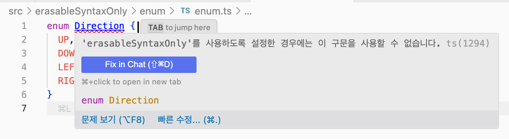

# Typescript: erasableSyntaxOnly

## 목차 (Table of Contents)

- [배경](#옵션이-추가된-배경)
- [제약사항](#제약사항)
  - [Enum으로 제약사항 알아보기](#enum으로-제약사항-알아보기)
    - [해결 방법](#해결-방법)
    - [좀 더 간단한 버전](#좀-더-간단한-버전)
  - [그외 제약사항들](#그외-제약사항들)
  - [하지만, Typescript 기능을 활용할 수 있는 방법은 있습니다.](#하지만-typescript-기능을-활용할-수-있는-방법은-있습니다)
- [권장사항](#권장사항)
- [한 가지 더: Type as Comments](#한-가지-더-type-as-comments)
- [요약](#요약)
- [참고자료](#참고자료)

---

최근에 몇가지 시험해볼 게 있어서 프로토타이핑을 진행할 일이 있었습니다. 평소 처럼 리액트 프로젝트를 새로 구성하고 이것저것 코딩을 하다가 처음보는 에러를 발견했습니다.

<p align="center"></p>

`erasableSyntaxOnly`... 이건 뭘까요? 잠시 에러를 쳐다보다가 찾아보기 시작했습니다.

그러니까 이 `erasableSyntaxOnly`는 [Typescript 5.8에 추가된 컴파일러 옵션](https://www.typescriptlang.org/docs/handbook/release-notes/typescript-5-8.html#the---erasablesyntaxonly-option)이었습니다.

이 옵션이 추가된 배경은 뭔지, 그래서 뭘 어떻게 바꿔야 하는지 하나씩 알아보겠습니다.

## 옵션이 추가된 배경

| 런타임          | TypeScript 지원 상태 | 특징                          |
| --------------- | -------------------- | ----------------------------- |
| Bun.js          | ✅ 네이티브 지원     | 초기부터 TypeScript 실행 지원 |
| Deno            | ✅ 네이티브 지원     | TypeScript 우선 설계          |
| Node.js (이전)  | ❌ 별도 도구 필요    | `tsc`, `ts-node` 등 필요      |
| Node.js 22.6.0+ | ✅ 실험적 지원       | `--experimental-strip-types`  |
| Node.js 23.6.0+ | ✅ 기본 지원         | 별도 플래그 불필요            |

원래 node.js는 Typescript 코드를 실행하는 기능이 없었습니다. 그래서 `tsc`를 통해 코드를 트랜스파일링 해서 Javascript로 변환해서 실행하거나 `ts-node`같은 도구를 사용했었죠. 하지만 `Bun.js`나 `Deno` 같이 Typescript 실행을 지원하는 런타임이 나오면서 node.js가 좀 뒤쳐지는 모양새가 되었습니다. 그러던 중에 node.js 22.6.0에서 Typescript 실행을 지원하는 [--experimental-strip-types 플래그가 추가되었고](https://github.com/nodejs/node/releases/tag/v22.6.0) , [node.js 23.6.0에서 별도의 설정없이 Typescript 코드를 실행할 수 있게 되었습니다.](https://github.com/nodejs/node/releases/tag/v23.6.0)

물론 아직까지는 [몇가지 제약사항이 있습니다.](https://nodejs.org/api/typescript.html#type-stripping)

## 제약사항

node.js는 Typescript 코드를 실행하기 위해 타입을 제거하는 과정(type stripping)을 거칩니다. 이 과정은 Typescript 컴파일러의 트랜스파일 없이 진행되는데요, 이렇게 하면 몇가지 이점이 있습니다. 우선 타입 제거와 트랜스파일링을 비교해볼까요?

| 특징          | 타입 스트리핑       | 전통적 트랜스파일링 |
| ------------- | ------------------- | ------------------- |
| **처리 방식** | 타입만 제거         | 전체 코드 변환      |
| **소스 맵**   | 불필요 (라인 유지)  | 필요                |
| **성능**      | 빠름                | 상대적으로 느림     |
| **디버깅**    | 직관적 (WYSIWYG)    | 소스 맵 의존        |
| **지원 문법** | 제한적 (erasable만) | 모든 TS 문법        |

- 소스 맵이 필요없음: 코드의 구조가 전혀 바뀌지 않기 때문에, 소스 맵을 생성할 필요가 없으며 직관적인 디버깅이 가능합니다.
- 성능 최적화: 컴파일 과정이 없기 때문에, 더 빠른 실행 속도를 기대할 수 있습니다.
- 실행 과정이 직관적: 타입을 제외하고 작성된 코드 그대로(WYSIWYG) 실행됩니다.

다만, 컴파일 과정을 거치지 않기 때문에 몇가지 제약사항이 생깁니다. Typescript 컴파일러가 특정 기능을 지원하기 위해 Javascript로 변환하는 과정에서 뭔가 코드를 생성해야 한다면 어떨까요? 앞서 말씀 드렸듯이 node.js는 Typescript 코드를 타입만을 제거하고 있는 그대로 실행합니다. 그렇기 때문에 이런 기능들은 더 이상 사용할 수 없으며 다른 방법을 찾아야 합니다.

이 글을 시작하면서 보여드렸던 enum이 이런 제약사항에 가장 큰 영향을 받는 기능입니다. enum을 중심으로 좀 더 자세히 알아보죠!

### enum으로 제약사항 알아보기

우선 다음과 같이 tsconfig.json을 설정해서 타입을 제거하지 않고 실행해보겠습니다.

```json
{
  "compilerOptions": {
    "erasableSyntaxOnly": false,
    "outDir": "./dist"
  }
}
```

그리고 다음과 같이 enum을 선언해보겠습니다.

```ts
// enum/enum.ts
enum Direction {
  UP,
  DOWN,
  LEFT,
  RIGHT,
}
```

그리고 다음과 같이 실행해보겠습니다.

```bash
npx tsc
```

그러면 다음과 같이 타입이 제거된 코드가 생성됩니다.

```js
// dist/enum.js
var Direction;
(function (Direction) {
  Direction[(Direction["UP"] = 0)] = "UP";
  Direction[(Direction["DOWN"] = 1)] = "DOWN";
  Direction[(Direction["LEFT"] = 2)] = "LEFT";
  Direction[(Direction["RIGHT"] = 3)] = "RIGHT";
})(Direction || (Direction = {}));
```

결과에서 볼 수 있듯이 enum은 원래 Javascript에서 제공되지 않으므로 Typescript 컴파일러가 트랜스파일 하는 과정에서 Javascript 코드를 생성합니다. 하지만 node.js에서 이 코드를 바로 실행하기 위해 `erasableSyntaxOnly` 옵션을 true로 설정하면, Typescript 컴파일러는 enum에 대해 불평을 쏟아냅니다.

<p align="center"></p>

#### 해결 방법

`erasableSyntaxOnly` 옵션은 이름 그대로 `타입을 제거하고 실행할 때 제거될 수 있는 문법들만 허용하겠다` 그래서 `node.js가 직접 Typescript를 실행할 수 있는 코드만 허용하겠다`는 의미입니다.

enum은 별도의 코드를 생성해야 하므로 사용할 수 없으므로, 다음과 같이 별도의 과정없이 사용할 수 있는 형태로 변경해야 합니다.

```ts
// enum/enum.ts
// 원래 코드
// enum Direction {
//   UP,
//   DOWN,
//   LEFT,
//   RIGHT,
// }

// erasableSyntaxOnly 옵션에서 사용가능한 enum
const Direction = {
  Up: "up",
  Down: "down",
  Left: "left",
  Right: "right",
} as const;

type DirectionType = (typeof Direction)[keyof typeof Direction];

const direction: DirectionType = Direction.Up;

console.log(direction);
```

enum 대신에 객체 리터럴(literal)을 사용해서 enum을 대신할 수 있도록 합니다. 컴파일된 결과를 확인해볼까요?

```js
// dist/enum.js
// 원래 코드
// enum Direction {
//   UP,
//   DOWN,
//   LEFT,
//   RIGHT,
// }
// erasableSyntaxOnly 옵션에서 사용가능한 enum
var Direction = {
  Up: "up",
  Down: "down",
  Left: "left",
  Right: "right",
};
var direction = Direction.Up;
console.log(direction);
```

타입 정보만 삭제된 채로 코드가 생성되었고, 다음과 같이 실행해보면 결과도 정상적으로 출력됩니다.

```bash
> node dist/enum.js
up
```

`type DirectionType = (typeof Direction)[keyof typeof Direction];` 이 부분이 상당히 혼란스러운데요. 이 부분은 다음과 같이 해석할 수 있습니다.

- `typeof Direction`: Direction은 객체 리터럴이고 다음과 같은 타입입니다.
  ```ts
  {
    readonly Up: "up";
    readonly Down: "down";
    readonly Left: "left";
    readonly Right: "right";
  }
  ```
- `keyof typeof Direction`: 위 객체의 키들을 의미합니다. 즉, `"Up" | "Down" | "Left" | "Right"` 입니다.
- `(typeof Direction)[keyof typeof Direction]`: 인덱스 타입을 의미하는데요, Direction 객체에서 사용가능한 모든 값을 유니온 타입으로 반환합니다. 즉, `"up" | "down" | "left" | "right"` 입니다.

조금 복잡해 보이긴 하지만, 이렇게 함으로써 다음과 같은 효과를 얻을 수 있습니다.

- 타입 안전성: enum과 마찬가지로 컴파일 타임에 타입 체크가 지원됩니다.
- IDE 지원: 타입 정보가 있으니까 IDE가 자동 완성을 지원합니다.
- 소스 맵이 필요없음: 삭제되는 코드는 빈칸으로 남겨서 라인 수를 유지하기 때문에 소스 맵을 생성 및 사용할 필요가 없습니다.
- 삭제가능!: 타입 정보만 삭제하고 바로 실행 가능합니다.
- 디버그 직관성: WYSIWYG(What You See Is What You Get). 코드를 보면 바로 이해할 수 있습니다.

#### 좀 더 간단한 버전

만약, `Direction.Up` 대신에 문자열 리터럴을 그대로 사용해도 된다면, 다음과 같이 유니온 타입으로 더 간단하게 사용할 수 있습니다.

```ts
// 좀 더 간단한 버전
type Direction = "up" | "down" | "left" | "right";

const direction: Direction = "up";

console.log(direction);
```

타입 정보를 활용할 수 있기 때문에 다음과 같이 IDE의 도움을 받을 수도 있습니다.

<p align="center"></p>

#### Enum 대안 비교표

| 방법                      | 문법 복잡도 | 타입 안전성 | IDE 지원 | 런타임 비용      | 추천도                           |
| ------------------------- | ----------- | ----------- | -------- | ---------------- | -------------------------------- |
| **기존 enum**             | ⭐⭐        | ⭐⭐⭐      | ⭐⭐⭐   | 높음 (객체 생성) | ❌ (erasableSyntaxOnly에서 불가) |
| **const 객체 + as const** | ⭐⭐⭐      | ⭐⭐⭐      | ⭐⭐⭐   | 낮음             | ⭐⭐⭐                           |
| **string literal union**  | ⭐          | ⭐⭐⭐      | ⭐⭐⭐   | 없음             | ⭐⭐⭐                           |

### 그외 제약사항들

클래스를 정의할 때 속성을 정의하는 대신에 생성자의 파라미터로 대신하는 패턴은 사용할 수 없습니다.

```ts
// ❌ erasableSyntaxOnly 옵션에서는 이렇게 하면 안됩니다!
class Person {
  constructor(private name: string, public age: number) {}
}

// ✅ 이렇게 해야 합니다.
class Person {
  private name: string;
  public age: number;

  constructor(name: string, age: number) {
    this.name = name;
    this.age = age;
  }
}
```

그리고 commonjs 스타일의 임포트 구문은 `erasableSyntaxOnly` 옵션에서 사용할 수 없습니다.

```ts
// ❌ erasableSyntaxOnly 옵션에서는 이렇게 하면 안됩니다!
import foo = require("foo");

// ✅ 이렇게 해야 합니다.
import foo from "foo";
```

#### erasableSyntaxOnly 제약사항 요약

| 문법                     | 사용 가능 여부 | 이유                     | 대안                      |
| ------------------------ | -------------- | ------------------------ | ------------------------- |
| **enum**                 | ❌             | 런타임 코드 생성 필요    | `const` 객체 + `as const` |
| **클래스 파라미터 속성** | ❌             | 자동 속성 할당 코드 생성 | 명시적 속성 선언          |
| **CommonJS import**      | ❌             | import 변환 필요         | ES6 import                |

### 하지만, Typescript 기능을 활용할 수 있는 방법은 있습니다.

[node.js 22.7.0에서 추가된](https://github.com/nodejs/node/releases/tag/v22.7.0) `--experimental-transform-types` 플래그를 사용하면 Typescript 에서만 제공되는 enum 같은 문법을 그대로 사용할 수도 있습니다!

테스트를 위해 일단 `erasableSyntaxOnly` 옵션을 비활성화 하고 enum 코드를 실행해볼까요?

```ts
// enum/enum.ts
enum Direction {
  UP,
  DOWN,
  LEFT,
  RIGHT,
}

const direction = Direction.UP;

console.log(direction);
```

그리고 다음과 같이 실행합니다.

```bash
> node --experimental-transform-types enum/enum.ts
0
(node:63565) ExperimentalWarning: Type Stripping is an experimental feature and might change at any time
(Use `node --trace-warnings ...` to show where the warning was created)
```

불평을 하긴 하지만, 정상적으로 실행되는 걸 확인할 수 있습니다. 이 옵션을 사용하면 내부적으로 [Amaro](https://www.npmjs.com/package/amaro) 를 활용해서 소스코드를 해석하고 변환한다고 합니다. 따라서 enum과 같은 Typescript 전용 문법도 사용할 수 있고, 디버깅을 위한 소스맵도 생성됩니다. 하지만 실행을 위해 코드를 변환해야 하니까 아무래도 성능은 떨어지겠죠?

#### Node.js TypeScript 실행 옵션 비교

| 플래그                           | 추가 버전 | 처리 방식   | enum 지원 | 성능 | 소스 맵 |
| -------------------------------- | --------- | ----------- | --------- | ---- | ------- |
| `--experimental-strip-types`     | 22.6.0    | 타입만 제거 | ❌        | 빠름 | 불필요  |
| `--experimental-transform-types` | 22.7.0    | Amaro 변환  | ✅        | 보통 | 생성됨  |

### 권장사항

앞서 설명했듯이 `erasableSyntaxOnly` 옵션은 타입을 제거하고 실행할 수 있는 문법만 허용합니다. Typescript 컴파일러가 코드를 변환하는 작업이 없어야 한다는 의미이며, 임포트 생략(import elision) 또한 여기에 포함됩니다. Typescript가 임의로 임포트를 생략하지 않도록 `verbatimModuleSyntax` 옵션을 같이 사용하는 게 좋습니다. [임포트 생략과 `verbatimModuleSyntax` 옵션에 대해서 다룬 글](../type-only-import/README.md)이 있으니 관심 있으신 분은 참고바랍니다.

### 한 가지 더: Type as Comments

Javascript 표준에서도 타입을 지원하기 위한 논의가 진행되고 있습니다. [TC39: Type as Comments](https://github.com/tc39/proposal-type-annotations) 를 보면, Typescript와 유사한 형태로 타입을 선언할 수 있도록 제안이 진행되고 있습니다. 여기서도 타입은 역시 런타임에서는 무시되는 형태인데요, Typescript가 가고자 하는 방향도 이와 맞닿아 있는 걸로 보입니다.

## 요약

### erasableSyntaxOnly 핵심 정리

| 항목          | 내용                                                      |
| ------------- | --------------------------------------------------------- |
| **목적**      | Node.js의 네이티브 TypeScript 실행 지원                   |
| **원리**      | 타입만 제거하고 코드 변환 없이 실행                       |
| **주요 장점** | ⚡ 빠른 실행, 🚫 소스 맵 불필요, 🎯 직관적 디버깅         |
| **주요 제약** | enum, 클래스 파라미터 속성, CommonJS import 사용 불가     |
| **권장 설정** | `erasableSyntaxOnly: true` + `verbatimModuleSyntax: true` |

### 마이그레이션 체크리스트

- [ ] `enum` → `const` 객체 + `as const` 또는 string literal union으로 변경
- [ ] 클래스 파라미터 속성 → 명시적 속성 선언으로 변경
- [ ] `import foo = require()` → ES6 `import` 구문으로 변경
- [ ] `verbatimModuleSyntax: true` 옵션 추가
- [ ] `erasableSyntaxOnly: true` 옵션 설정

## 참고자료

- [TypeScript 5.8 릴리즈 노트](https://www.typescriptlang.org/docs/handbook/release-notes/typescript-5-8.html#the---erasablesyntaxonly-option)
- [Node.js 22.6.0 릴리즈 노트](https://github.com/nodejs/node/releases/tag/v22.6.0)
- [Node.js 23.6.0 릴리즈 노트](https://github.com/nodejs/node/releases/tag/v23.6.0)
- [TypeScript's `erasableSyntaxOnly` Flag](https://oida.dev/erasable-syntax-only/)
- [Alternatives to Typescript Enums](https://maxheiber.medium.com/alternatives-to-typescript-enums-50e4c16600b1)
