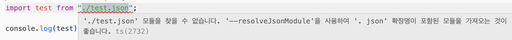
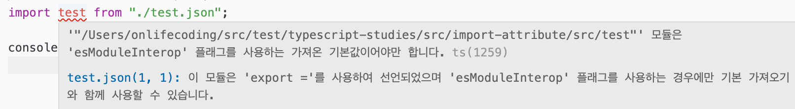

# Typescript: Import Attributes

## 개요

최근에 틈이 날 때 마다 이전 타입스크립트 버전에 대한 릴리즈 노트를 읽어보고 있습니다. 리액트, Nest.js로 개발하면서 자연스럽게 타입스크립트를 몇 년간 사용해왔지만... 사실 제대로 아는 게 없었기 때문이죠. 타입스크립트차 처음 소개된 게 2012년이니까 벌써 13년이나 지났습니다. 긴 시간 동안 참 많은 일이 있었고 단순히 언어를 사용하는 것 만으로는 제대로 이해할 수 없겠죠.

그러던 중에 [5.3 버전에서 `Import Attributes` 지원이 추가되었다는 걸](https://www.typescriptlang.org/docs/handbook/release-notes/typescript-5-3.html#import-attributes) 봤습니다. 내용은 짧았지만 이게 무슨 소리인지 이해하는 데는 시간이 좀 걸렸습니다. 이제 부터 그 이야기를 좀 해볼까 합니다.

## 나도 모르게 자연스럽게 쓰던 코드

예전에 Node.js로 코드를 짜다 보면 뭔가 데이터를 구성하고 가공하는 코드를 많이 짜곤했습니다. 그럴때 json 파일을 가져오고 활용하는 경우가 많았죠.

예를 들어서 다음과 같은 json 파일이 있을 때,

```json
// src/import-attribute/src/test.json
{
  "name": "test",
  "description": "test",
  "isActive": true
}
```

이 파일을 가져오고 활용하는 코드는 다음과 같이 작성했습니다.

```javascript
// src/import-attribute/src/import-json.js
const test = require("./test.json");

console.log(test);
```

이렇게 json 파일을 가져오면, Node.js 런타임이 파일을 읽어와서 변환까지 처리해줍니다. 그리고 가져온 데이터 객체의 타입을 추론해서 코드 자동 완성까지도 지원해줬죠. Node.js 런타임이 변환까지 처리해주기 때문에 json 파일의 형식이 잘못되어 있다면, require 구문에서 오류가 발생합니다.

## Typescript 에서는...?

위 코드를 Typescript로 작성해보겠습니다.

```typescript
// src/import-attribute/src/import-json.ts
import test from "./test.json";

console.log(test);
```

위 코드를 작성하자 마자, 다음과 같이 오류가 발생합니다.

<p align="center">
  
</p>

타입 스크립트에서 json 파일을 임포트 하려면 [`resolveJsonModule` 옵션](https://www.typescriptlang.org/tsconfig/#resolveJsonModule) 을 true로 설정해야 합니다. tsconfig.json에 다음과 같이 옵션을 추가합니다.

```json
// tsconfig.json
{
  "compilerOptions": {
    "resolveJsonModule": true
  }
}
```

설정을 추가하면 새로운 에러가 발생합니다.

<p align="center">
  
</p>

그러니까 export default 없이 정의된 json 파일을 임포트 해야 하니 [`allowSyntheticDefaultImports` 옵션](https://www.typescriptlang.org/tsconfig/#allowSyntheticDefaultImports) 을 true로 설정해야 합니다. tsconfig.json에 다음과 같이 옵션을 추가합니다.

```json
// tsconfig.json
{
  "compilerOptions": {
    "resolveJsonModule": true,
    "allowSyntheticDefaultImports": true
  }
}
```

옵션을 추가하고 나면 오류가 사라집니다! 그러면 일단 컴파일을 진행하고 코드를 실행해볼까요?

```bash
> npx tsc
> node import-json.js
undefined
```

json 파일이 제대로 임포트되지 않고 undefined가 출력됩니다. 컴파일된 코드를 확인해보면 다음과 같습니다.

```javascript
// src/import-json.js
"use strict";
Object.defineProperty(exports, "__esModule", { value: true });
var test_json_1 = require("./test.json");
console.log(test_json_1.default);
```

import가 아닌 require 구문을 사용하도록 컴파일이 되었네요. 현재 타입스크립트 버전(5.8.3)에서 지원하는 가장 최신의 javascript 문법을 사용하도록 tsconfig.json 에 옵션을 지정해보겠습니다.

```json
// tsconfig.json
{
  "compilerOptions": {
    "resolveJsonModule": true,
    "target": "esnext",
    "moduleResolution": "node",
    "allowSyntheticDefaultImports": true
  }
}
```

`target`에는 가장 최신의 javascript 문법을 사용하도록 `esnext`를 사용하도록 지정했습니다. 그리고 변경된 `target`에서 `resolveJsonModule` 옵션을 같이 사용할 수 있도록 `moduleResolution`을 `node`로 지정했습니다.

> 생성되는 코드에서 import 구문을 사용하기 위해서 `package.json`에서 `type`을 `module`로 지정해줍니다.

옵션을 추가하고 다시 컴파일 및 실행 결과를 볼까요?

```bash
> npx tsc
> node import-json.js
node:internal/modules/esm/assert:88
        throw new ERR_IMPORT_ATTRIBUTE_MISSING(url, 'type', validType);
              ^

TypeError [ERR_IMPORT_ATTRIBUTE_MISSING]: Module "file:///Users/onlifecoding/src/test/typescript-studies/src/import-attribute/src/test.json" needs an import attribute of "type: json"
    at validateAttributes (node:internal/modules/esm/assert:88:15)
    at defaultLoad (node:internal/modules/esm/load:130:3)
    at async ModuleLoader.loadAndTranslate (node:internal/modules/esm/loader:514:32) {
  code: 'ERR_IMPORT_ATTRIBUTE_MISSING'
}

Node.js v22.14.0
```

뭔가 복잡해보이지만 결론은 `type: json` 이라는 `import attribute`를 지정해야 한다는 오류입니다.

참고로 만약 Node.js 버전이 20 또는 18 이라면 다음과 같은 오류가 발생합니다.

```bash
node:internal/errors:497
    ErrorCaptureStackTrace(err);
    ^

TypeError [ERR_IMPORT_ASSERTION_TYPE_MISSING]: Module "file:///Users/onlifecoding/src/test/typescript-studies/src/import-attribute/src/test.json" needs an import assertion of type "json"
    at new NodeError (node:internal/errors:406:5)
    at validateAssertions (node:internal/modules/esm/assert:94:15)
    at defaultLoad (node:internal/modules/esm/load:122:3)
    at ModuleLoader.load (node:internal/modules/esm/loader:396:13)
    at ModuleLoader.moduleProvider (node:internal/modules/esm/loader:278:56)
    at new ModuleJob (node:internal/modules/esm/module_job:65:26)
    at #createModuleJob (node:internal/modules/esm/loader:290:17)
    at ModuleLoader.getJobFromResolveResult (node:internal/modules/esm/loader:248:34)
    at ModuleLoader.getModuleJob (node:internal/modules/esm/loader:229:17)
    at async ModuleWrap.<anonymous> (node:internal/modules/esm/module_job:85:21) {
  code: 'ERR_IMPORT_ASSERTION_TYPE_MISSING'
}
```

## import attribute

위 오류를 해결하기 위해서 임포트 구문에 `import attribute`를 추가해보겠습니다.

```typescript
// src/import-attribute/src/import-json.ts
import test from "./test.json" with { type: "json" }

console.log(test);
```

그런데 여기서 또 하나의 오류가 발생합니다.

> `가져오기 특성은 '--module' 옵션이 'esnext', 'node18', 'node20', 'nodenext' 또는 'preserve'로 설정된 경우에만 지원됩니다.`

그러니까, tsconfig.json에서 `module` 옵션을 `esnext`로 지정해줘야 합니다.

```json
{
  "compilerOptions": {
    "resolveJsonModule": true, // JSON을 임포트 할 수 있도록 설정
    "module": "esnext", // import attribute를 사용하기 위해서 설정
    "target": "esnext",
    "moduleResolution": "node",
    "allowSyntheticDefaultImports": true
  }
}
```

이제 다시 코드를 컴파일 및 실행 해보겠습니다.

```bash
> npx tsc
> node import-json.js
{ name: 'test', description: 'test', isActive: true }
```

json 파일 하나를 임포트하고 실행하기 위해서 참 먼 길을 돌아왔습니다. 도대체 왜 이렇게 복잡해진 걸까요? 이 모든 건 다 `보안` 때문입니다.

위와 같이 json 파일을 임포트할 때, 확장자 만을 확인하고 파일의 내용이 json 인지는 확인하지 않는 문제가 있었고 이게 보안상 아주 취약한 문제가 될 수 있었습니다. 확장자는 json 파일이지만 실제로는 뭔가 이상한 동작을 수행하는 스크립트를 포함하고 있을 수도 있었죠.

그래서 `import attribute`를 사용해서 인터넷의 파일을 로드할 때, 확장자 대신에 파일의 MIME 타입이나 CSP 등의 정책에 맞는지 등을 확인할 수 있도록 처리합니다. Node.js에서도 마찬가지 입니다. 누군가 임포트되는 json 파일을 바꿔치기 한다면 동일한 문제가 발생할 수도 있겠죠.

## import assertion? attribute? 헷갈리네!

이 기능은 최초 제안된 이후 이름이 여러번 바뀌었는데요, 그 [과정](https://github.com/tc39/proposal-import-attributes?tab=readme-ov-file#history)을 살펴보면 다음과 같습니다.

- 2019년 12월: `module attributes` 로 제안되어 Stage 1 승인
- 2020년 6월: `module attributes` Stage 2 승인
- 2020년 9월: 이름이 `import assertions`로 변경되면 Stage 3 승인
- 2021~2022: `import assertions` 및 [JSON Modules 제안](https://github.com/tc39/proposal-json-modules) 을 Chrome, Node.js, Deno에서 구현함.
- 2023년 1월: HTML에서 javascript가 아닌 모듈에 대한 처리에 호환되지 않는 부분이 있어서 `import assertions`는 Stage 2로 돌아감
- 2023년 3월: 이름이 `import attributes`로 변경되면 Stage 3 으로 다시 승인됨

그리고 현재 `import attribute`는 Stage 4(Finished) 단계로 공식 스펙에 편입될 준비를 모두 마친 상태입니다. 앞서 Node.js 20과 18 코드를 실행했을 때 오류 메세지가 `needs an import assertion of type "json"` 이라고 나왔던 건 바로 이런 이유 때문이었죠.

## 타입 스크립트는 문법을 허용할 뿐 아무 책임을 지지 않습니다!

릴리즈 노트에서도 설명하고 있지만, 타입스크립트는 그저 이 구문을 사용할 수 있게 지원하는 것 뿐이며 어떤 해석도 하지 않습니다. 왜냐면 이 구문을 어떻게 처리할지는 각 브라우저 및 런타임에 달려있기 때문이죠. 앞서 보신것 처럼 Node.js는 엄격하게 이 구문을 통해 json 파일의 타입을 체크하고 있습니다.

## 참고 자료

- [Import Attributes](https://www.typescriptlang.org/docs/handbook/release-notes/typescript-5-3.html#import-attributes)
- [resolveJsonModule](https://www.typescriptlang.org/tsconfig/#resolveJsonModule)
- [allowSyntheticDefaultImports](https://www.typescriptlang.org/tsconfig/#allowSyntheticDefaultImports)
- [tc39/proposal-import-attributes](https://github.com/tc39/proposal-import-attributes)
- [tc39/proposal-json-modules](https://github.com/tc39/proposal-json-modules)
